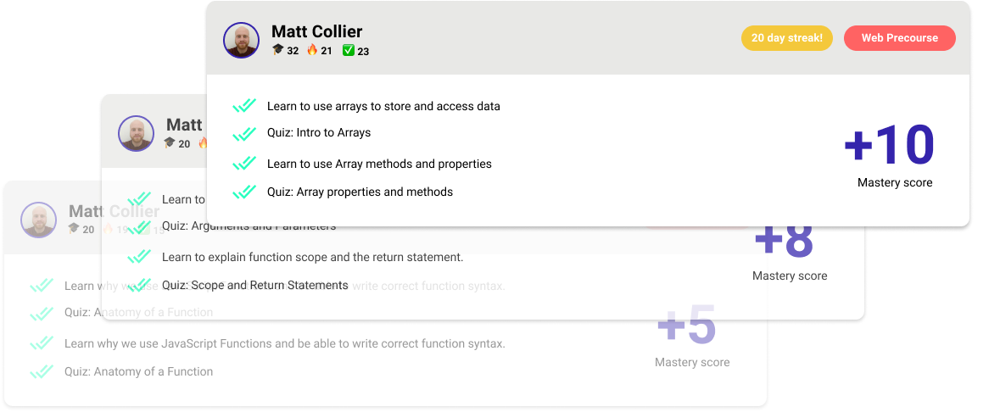

# Encode

Encode is a motivational game to help you smash the Lambda School precourses and get accepted as a student.

- Encode community encourages your progress through the Lambda School precourse, and makes it rewarding!
- Work with other students in the same situation as you and set up a study group.
- Log your education activity and prove your understanding to Lambda School.

Sign up to play here [encode.app](https://encode.app)

## Scoring mechanism:

- 1 points - Reading a new section
- 2 points - Quizzes and Reflection
- 3 points - Completing code challenges
- 5 points - Reusing concepts in different scenarios
- 7 points - Refactoring
- 10 points - Teaching others

Based on Bloom's educational taxonomy ([read more here](http://www.celt.iastate.edu/teaching/effective-teaching-practices/revised-blooms-taxonomy/))

## Streaks 

Earn bonus badges when you build up a daily streak of working through your precourse.

## Set up:

Clone the project and run `npm install`

Create an .env file with the following variables

~~~~
DB_HOST=localhost
DB_NAME=
DB_USERNAME=
DB_PASSWORD=
~~~~~

Run `npm start` to launch the app and navigate to localhost:9090

